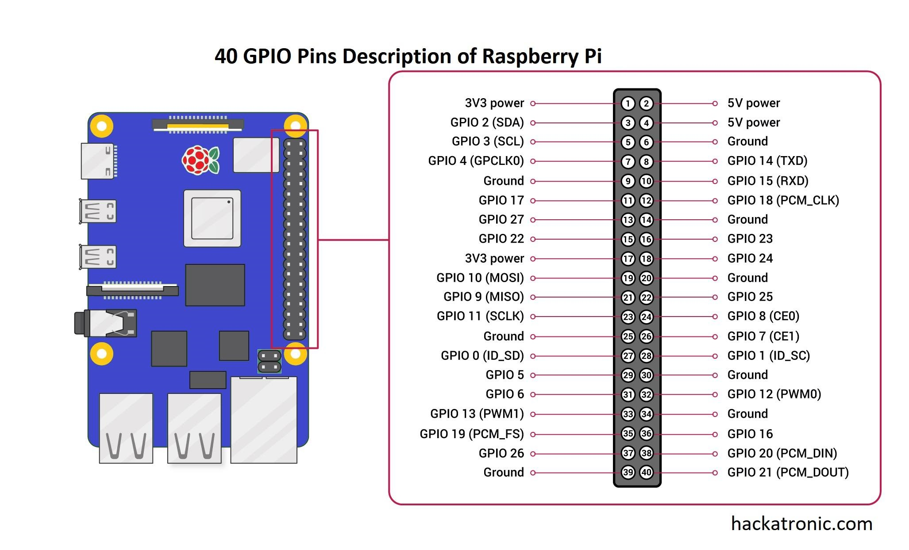

# 🚗 Multi-Agent TinyML & Small Language Model Architecture for Intelligent Vehicle Monitoring

<p align="center">
  
</p>


### Authors: [Morsinaldo Medeiros](https://github.com/Morsinaldo), [Marianne Diniz](https://github.com/MarianneDiniz), and [Ivanovitch Silva](https://github.com/ivanovitchm)

## 📌 Abstract

While the Internet of Intelligent Vehicles (IIoV) enables advanced sensing, the integration of generative AI for driver interaction is hindered by the high computational demands and non-deterministic nature of large language models. In constrained embedded environments, local natural-language feedback must be delivered without compromising time-critical sensing or data privacy. To address this gap, this paper proposes an onboard multi-agent architecture that orchestrates quantized Small Language Models (SLMs) alongside a multimodal sensing pipeline (OBD-II, GPS, and inertial data). The system, deployed on a Raspberry Pi 5, utilizes a structured agent layer as a controller to isolate intensive generative tasks and regulate the contextual integrity of the output. The approach was validated using replayed real-driving datasets from a diverse ten-vehicle fleet, evaluating multiple SLMs through latency, memory pressure, energy consumption, and response stability. Statistical analysis (`p < 0.001`) identified SmolLM2 as the most efficient model, achieving a median throughput of 7.2 tokens/s with a peak memory footprint of 407MB. Results demonstrate that asynchronous execution preserves millisecond-range responsiveness for critical safety functions, while agent-mediated control improves the inclusion of safety-related context across models. These findings provide a sustainable and private framework for deploying interactive, context-aware intelligence in modern automotive systems.

## Overview

This repository contains a multi-agent embedded architecture for on-board vehicle monitoring. The system combines TinyML components, sensor fusion, and small language models (SLMs) to process driving data locally on a Raspberry Pi 5.

The main runtime stack includes:

- a behavior agent for driver behavior classification with MMCloud
- a safety agent for nearby accident and fine lookups based on processed PRF datasets
- a policy layer that combines agent outputs into a driving state
- an advice agent that generates short natural-language guidance

In addition to the runtime code, the repository also includes reproducible analysis notebooks, processed datasets, and generated figures and reports.

## Repository Layout

```text
.
├── agents/                  # Multi-agent runtime components
├── data/processed/          # Canonical processed datasets used by notebooks
├── data/trips/              # Runtime trip logs generated by websocket_obd.py
├── docs/notebooks/          # Notebook-specific documentation
├── figures/                 # Static project and README assets
├── helpers/                 # Analysis helpers
├── models/                  # Trained models and MMCloud implementation
├── nlg/                     # LLM runtime code
├── notebooks/               # Maintained notebooks
├── outputs/figures/         # Generated notebook figures
├── outputs/reports/         # Generated notebook reports
├── policy/                  # Policy engine
├── replays/                 # Replay CSVs used by websocket_obd.py
├── services/                # Runtime services
├── utils/                   # Sensor and utility modules
├── requirements.txt         # Python dependencies
└── websocket_obd.py         # Main runtime entrypoint
```

## Data Organization

The repository uses the following canonical locations:

- `data/processed/codecarbon/` for CodeCarbon CSV inputs
- `data/processed/emissions/` for the main processed experiment snapshot used in the article
- `outputs/figures/` for generated figures
- `outputs/reports/` for generated reports and consolidated tables

Runtime trip logs are written by `websocket_obd.py` to:

- `data/trips/`

This runtime log directory is not used by the main analysis notebook unless you explicitly decide to export and process those logs later.

`figures/` is reserved for static documentation assets and should not be used for generated notebook outputs.

## Main Notebook

### `notebooks/analysis.ipynb`

This is the main analysis notebook used for the article. It loads the processed experiment snapshot, aligns it with CodeCarbon measurements, generates the figures, and reconstructs the statistical summary table used in the paper.

## Setup

### 1. Clone the repository

```bash
git clone https://github.com/conect2ai/IEEE-ITS-MultiAgent-SLM.git
cd IEEE-ITS-MultiAgent-SLM
```

### 2. Create and activate a Python environment

```bash
python3 -m venv .venv
source .venv/bin/activate
```

### 3. Install the requirements

```bash
pip install --upgrade pip
pip install -r requirements.txt
```

The `requirements.txt` includes the `obd` library required by `websocket_obd.py`.

### 4. Download an LLM model

Due to size constraints, the GGUF language model is not stored in this repository.

Some options are:

- [Qwen2.5-0.5B-Instruct-GGUF](https://huggingface.co/Qwen/Qwen2.5-0.5B-Instruct-GGUF)
- [SmolLM20360M-Instruct](https://huggingface.co/bartowski/SmolLM2-360M-Instruct-GGUF)
- [Gemma3-270M-Instruct](https://huggingface.co/unsloth/gemma-3-270m-it-GGUF)

> We recommend the quantized versions Q_4_K_M..

Save the downloaded `.gguf` file inside:

```text
models/
```

The runtime expects an OpenAI-compatible local server on:

```text
http://127.0.0.1:8080/v1
```

So the model should be served with your preferred local runtime, such as `llama.cpp`, before starting `websocket_obd.py`.

## Running the Runtime

The embedded runtime is centered on `websocket_obd.py`, which orchestrates sensor data, agents, replay/live ingestion, and the UI.

Run it with:

```bash
python websocket_obd.py
```

By default, the script creates a trip log under `data/trips/`.

## Replay Mode vs. Live Mode

The execution mode is controlled directly in [`websocket_obd.py`](./websocket_obd.py).

Relevant flags:

- `REPLAY_MODE = 1` enables replay from a CSV file
- `REPLAY_CSV = "./replays/trip_log_etios_0.csv"` selects the replay file
- `REPLAY_SPEED` controls replay speed
- `REPLAY_LOOP` controls whether replay restarts when it ends
- `REPLAY_CLOCK` controls whether replay respects the original timestamps

### To run with a replayed dataset

Keep:

```python
REPLAY_MODE = 1
```

and set `REPLAY_CSV` to the dataset you want to replay.

### To run in live mode

Change:

```python
REPLAY_MODE = 0
```

With `REPLAY_MODE = 0`, the application will stop using the replay CSV and will read from the live OBD path instead.

## Running on Raspberry Pi 5

### Hardware

- Device: `Raspberry Pi 5`
- RAM: `8 GB`
- SD card: minimum `64 GB`, recommended `128 GB`
- Recommended OS: `Raspberry Pi OS (64-bit)`

### Peripherals used

- `GPS GT-U7`
- `MPU6050`
- Bluetooth OBD-II adapter

## Raspberry Pi Wiring

<p align="center">
  
</p>

Female-to-female jumper wires were used in the reference setup.

### MPU6050 → I2C

- `VCC` → `3.3V` (pin 1) or `5V` (pin 2 or 4), depending on the GY-521 board
- `GND` → any GND pin
- `SDA` → `GPIO 2` (pin 3)
- `SCL` → `GPIO 3` (pin 5)

### GPS GT-U7 → UART

- `VCC` → `3.3V` or `5V`, depending on the module
- `GND` → any GND pin
- `TX` from the GPS → `GPIO 15 / RXD` (pin 10)
- `RX` from the GPS → `GPIO 14 / TXD` (pin 8)
- Baud rate: `9600`

## Raspberry Pi Configuration

### 1. Enable I2C

```bash
sudo raspi-config
```

Navigate to:

```text
3 Interface Options -> I4 I2C -> Yes
```

### 2. Enable UART

Still inside `raspi-config`:

```text
3 Interface Options -> I6 Serial Port
Would you like a login shell to be accessible over serial? -> No
Would you like the serial port hardware to be enabled? -> Yes
```

### 3. Install Raspberry Pi packages

```bash
sudo apt update
sudo apt upgrade
sudo apt install pps-tools gpsd gpsd-clients chrony i2c-tools python3-smbus
```

### 4. Configure boot and kernel modules

Append the GPS and UART configuration:

```bash
sudo bash -c "echo '# the next 3 lines are for GPS PPS signals' >> /boot/firmware/config.txt"
sudo bash -c "echo 'dtoverlay=pps-gpio,gpiopin=18' >> /boot/firmware/config.txt"
sudo bash -c "echo 'enable_uart=1' >> /boot/firmware/config.txt"
sudo bash -c "echo 'init_uart_baud=9600' >> /boot/firmware/config.txt"
```

Then enable the PPS GPIO module:

```bash
sudo bash -c "echo 'pps-gpio' >> /etc/modules"
```

### 5. Reboot

```bash
sudo reboot
```

## Manual GPS Test

These commands are useful for validating the GPS before running the application.

Stop the background GPS service if needed:

```bash
sudo systemctl stop gpsd
sudo systemctl stop gpsd.socket
```

Start `gpsd` manually:

```bash
sudo gpsd /dev/ttyAMA0 -F /var/run/gpsd.sock
```

Inspect the GPS feed:

```bash
cgps -s
```

Or inspect raw NMEA traffic:

```bash
gpsmon /dev/ttyAMA0
```

## Bluetooth OBD-II Setup

### 1. Pair the adapter

```bash
bluetoothctl
```

Inside the prompt:

```text
power on
agent on
scan on
```

When the OBD-II device appears, pair and trust it:

```text
pair 00:1D:A5:68:98:8B
connect 00:1D:A5:68:98:8B
trust 00:1D:A5:68:98:8B
exit
```

### 2. Bind the Bluetooth serial port

```bash
sudo rfcomm bind /dev/rfcomm0 00:1D:A5:68:98:8B
```

### 3. Test the communication

```bash
sudo apt install minicom
minicom -b 38400 -o -D /dev/rfcomm0
```

### 4. Point the runtime to the OBD port

In Python, the OBD library can use:

```python
import obd
connection = obd.OBD("/dev/rfcomm0")
```

In this repository, the runtime reads the OBD port from environment variables and the live OBD path is handled inside `websocket_obd.py`.

## Running the Analysis Notebook

Open:

- `notebooks/analysis.ipynb`

The notebook resolves the repository root automatically, so it can be executed from either:

- the repository root
- the `notebooks/` directory

## Runtime Notes

Supporting modules are organized under:

- `agents/`
- `policy/`
- `services/`
- `utils/`
- `nlg/`


## License

This project is released under the MIT License. See `LICENSE` for details.

## About Conect2AI

[Conect2AI](http://conect2ai.dca.ufrn.br) is a research group at the Federal University of Rio Grande do Norte (UFRN) focused on applied artificial intelligence in embedded systems, connected mobility, and related domains.
